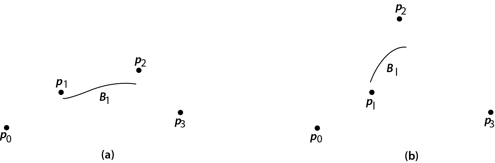
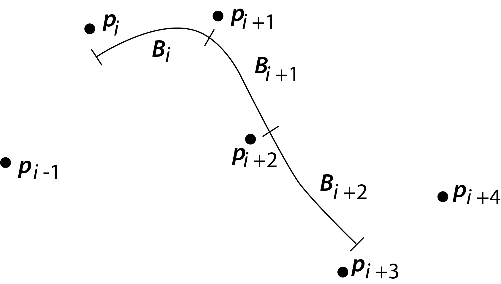

<h3>B-Spline Curves</h3>

We now discuss B-splines. These curves are like Bezier curves in that they do not ordinarily pass through the given data points.  They can be of any degree, but we will concentrate on the cubic form. Cubic B-splines resemble the ordinary cubic splines of the previous section in that a separate cubic is derived for each pair of points in the set. However, the B-spline need not pass through any points of the set that are used in its definition.

&emsp; We begin the description by stating the formula for a cubic B-spline in terms of parametric equations whose parameter is <i>u</i>.

&emsp; Given the points <i>pi= (xi, yi), i = 0, 1,..., n</i>, the cubic B-spline for the interval <i>(pi,pi+1), i=1,2,...,n-1</i>, is

$$
\begin{aligned}
   B_i(u) &=  \sum_{k=-1}^2 b_kp_{i+k}, \quad where \\ \\ 
   b_{-1} &= \frac{(1-u)^3}{6}, \\ \\ 
   b_0 &= \frac{u^3}{2} - u^2 + \frac{2}{3}, \qquad \qquad \qquad equ(1) \\ \\ 
   b_1 &= -\frac{u^3}{2} + \frac{u^2}{2} + \frac{u}{2} + \frac{1}{6}, \\ \\
   b_2 &= \frac{u^3}{6}, \qquad 0\le u \le 1.
\end{aligned}
$$

&emsp; As before, <i>pi</i> refers to the point <i>(xi, yi)</i>; it is a two-component vector. The coefficients, the <i>bk's</i> serve as a basis and do not change as we move from one set of points to the next. Observe that they can be considered weighting factors applied to the coordinates of a set of four points. The weighted sum, as <i>u</i> varies from 0 to 1, generates the B-spline curve.

&emsp; If we write out the equations for <i>x</i> and <i>y</i> from Eq. (1), we get

$$
\begin{aligned}
   x_i(u) =\ &\frac{1}{6}(1-u)^3x_{i-1} + \frac{1}{6}(3u^3 - 6u^2 +4)x_i \\
    &+ \frac{1}{6}(-3u^3+3u^2+3u+1)x_{i+1} + \frac{1}{6}u^3x_{i+2} \\ \\

    y_i(u) = \ &\frac{1}{6}(1-u)^3y_{i-1} + \frac{1}{6}(3u^3 - 6u^2 +4)y_i \\
    &+ \frac{1}{6}(-3u^3+3u^2+3u+1)y_{i+1} + \frac{1}{6}u^3y_{i+2}
\end{aligned}
$$

Note the notation here: <i>xi(u)</i> and <i>yi(u)</i> are functions (of <i>u</i>) and <i>xi</i>, <i>yi</i> are components of the point <i>p</i>. (The end portions are a special situation that we discuss later.)

&emsp; As we have said, the <i>u</i>-cubics act as weighting factors on the coordinates of the four successive points to generate the curve. For example, at <i>u</i> = 0, the weights applied are 1/6, 2/3, 1/6, and 0. At <i>u</i> = 1, they are 0, 1/6, 2/3, and 1/6. These values vary throughout the interval from <i>u</i> = 0 to <i>u</i> = 1. As an exercise, you are asked to graph these factors. This will give you a visual impression of how the weights change with <i>u</i>.

$$ \text{Figure 1}$$

&emsp; Let us now examine two B-splines determined from a set of exactly four points. Figure 1a and 1b shows the effect of varying just one of the points. As you would expect, when <i>p2</i> is moved upward and to the left, the curve tends to follow; in fact, it is pulled to the opposite side of <i>p1</i>. You may be surprised to see that the curve is never very close to the two intermediate points, though it begins and ends at positions somewhat adjacent. It will be helpful to think of the curve generated from the defining equation for <i>B1</i> as associated with a curve that goes from near <i>p1</i> to <i>p2</i>. It is also helpful to remember that points <i>p0</i>, <i>p1</i>, <i>p2</i> and <i>p3</i> are used to get <i>B1</i>

&emsp; Because a set of four points is required to generate only a portion of the B-spline, that associated with the two inner points, we must consider how to get the B-spline for more than four points as well as how to extend the curve into the region outside of the middle pair. We use a method analogous to the cubic splines of Section 3.3 marching along one point at a time, forming new sets of four. We abandon the first of the old set when we add the new one.

&emsp; The conditions that we want to impose on the B-spline are exactly the same as for ordinary splines: continuity of the curve and its first and second derivatives. It turns out that the equations for the weighting factors (the <i>u</i>-polynomials, the <i>bk</i>) are such that these requirements are met. Figure 2 shows how three successive parts of a B-spline might look. 

&emsp; We can summarize the properties of B-splines as follows:

   <ol type="1">
      <li> 
         Like the cubic splines of Section 3.4, B-splines are pieced together so they agree at their joints in three ways:
         $$
            \begin{aligned}
               &a. \quad B_i(1) &= B_{i+1}(0) &= \frac{p_i + 4p_{i+1} + p_{i+2}}{6}, \\ \\
               &b. \quad B_i^{'}(1) &= B_{i+1}^{'}(0) &= \frac{-p_i + p_{i+2}}{2}, \\ \\ 
               &c. \quad B_i^{''}(1) &= B_{i+1}^{''}(0) &= p_i - 2p_{i+1} + p_{i+2}.
            \end{aligned}
         $$
          
         'The subscripts here refer to the portions of the curve and the points in Figure 2.
      </li>
      <li>
         The portion of the curve determined by each group of four points is within the convex hull of these points.
      </li>
   </ol>

$$
   \text{Figure 2:  Successive B-splines joined together }
$$

&emsp; Now we consider how to generate the ends of the joined B-spline. If we have points from <i>p0</i> to <i>pn</i>, we already can construct B-splines <i>B1</i> through <i>Bn-2</i>. We need <i>B0</i> and <i>Bn-1</i>. Our problem is that, using the procedure already defined, we would need additional points outside the domain of the given points. We probably also want to tie down the curve in some way - having it start and end at the extreme points of the given set seems like a good idea. How can we do this?

&emsp; First, we can add more points without creating artificiality by making the added points coincide with the given extreme points. If we add not just a single fictitious point at each end of the set, but two at each end, we will find that the new curves not only join properly with the portions already made, but start and end at the extreme points as we wanted. (It looks like we have added two extra portions, but reflection shows these are degenerate, giving only a single point.)

&emsp; In summary: We add fictitious points <i>p-2, p-1, pn+1</i> and <i>pn+2</i>, with the first two identical with <i>p0</i> and the last two identical with <i>pn</i>. (There are other methods to handle the starting and ending segments of B-splines that we do not cover.)

&emsp; The matrix formulation for cubic B-splines is helpful. Here it is:

$$
\boxed{
   \begin{aligned}
      B_i(u) &= \frac{1}{6} \begin{bmatrix}
         u^3 & u^2 & u & 1
      \end{bmatrix}
      \begin{bmatrix}
         -1 & 3 & -3 & 1 \\
         3 & -6 & 3 & 0 \\
         -3 & 0 & 3 & 0 \\
         1 & 4 & 1 & 0 
      \end{bmatrix}
      \begin{bmatrix}
         p_{i-1} \\
         p_{i} \\
         p_{i+1} \\
         p_{i+2} 
      \end{bmatrix} \\ \\
      &= \frac{u^TM_bp}{6}
   \end{aligned}
}\qquad \qquad equ(2)
$$

This applies on the interval [0, 1] and for the points <i>(pi, pi+1)</i>.

B-splines differ from Bezier curves in three ways:

   <ol>
      <li>For a B-spline, the curve does not begin and end at the extreme points.</li>
      <li>The slopes of the B-splines do not have any simple relationship to lines drawn between the points.</li>
      <li>The endpoints of the B-splines are in the vicinity of the two intermediate given points, but neither the <i>x</i>- nor the <i>y</i>-coordinates of these endpoints normally equal the coordinates of the intermediate points.</li>
   </ol>

   